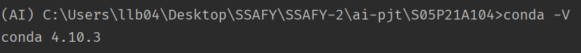
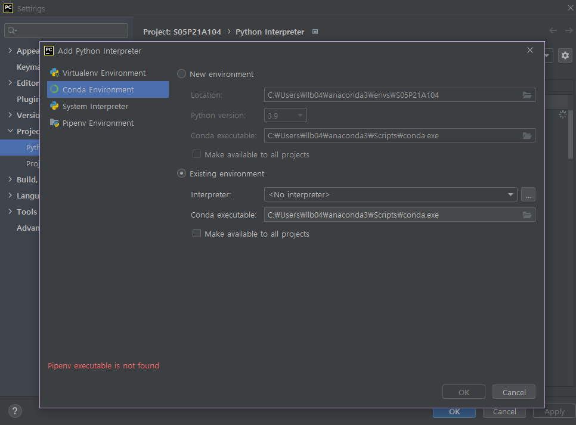
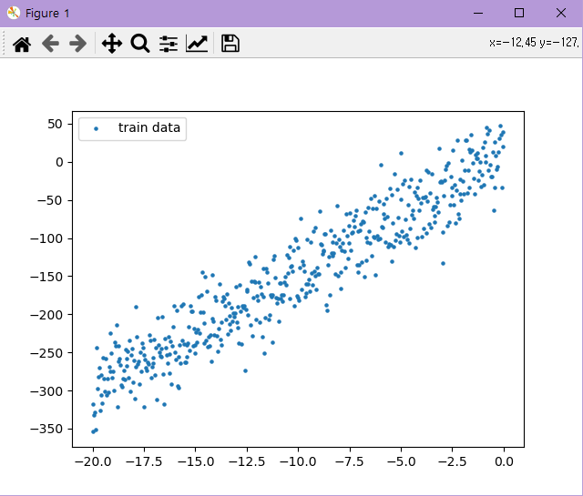

# README

특화 프로젝트: 인공지능(영상)에 대한 Sub1 개발 내용을 기록


## 0. 개발 환경

### 아나콘다



### 파이참

- 커뮤니티 Edit. 21.01.02

- 인터프리터




## 1. Req.1: 단순 선형 회귀 모델 구현

### (1) 데이터 읽기 및 시각화

- linear_train.npt을 load하고 Matplotlib를 이용해 데이터를 시각화 한다.




```python
# linear_regression.py 참고

import numpy as np
import matplotlib.pyplot as plt

from models.linear_model import LinearModel

# 데이터 불러오기
train_data = np.load(".\\datasets\\linear_train.npy")

# tf 형식에 맞게 변환
x_data = np.expand_dims(train_data[:, 0], axis=1)
y_data = train_data[:, 1]

# 결과 시각화
plt.scatter(x_data, y_data, s=5, label="train data")
plt.legend()
plt.show()
```

#### `np.expand_dims()`

배열에 차원을 추가하는 함수

#### `np.load()`

외부 파일을 배열로 불러오는 함수


### (2) 선형 모델 클래스 구현

- LinearModel 클래스는 tf.keras.Model을 상속한다.
- call() 호출 시 입력 값에 대한 결과 값을 리턴한다.

```  python
# models/lineear_model.py

import tensorflow as tf


class LinearModel(tf.keras.Model):
    def __init__(self, num_units):
        super(LinearModel, self).__init__()
        self.units = num_units
        self.model = tf.keras.layers.Dense(units=self.units)

    def call(self, x):
        y = self.model(x)
        return y
```


### (3) 최적화 함수 및 손실 함수 바인딩

- 모델의 학습에 사용할 최적화 함수 및 손실 함수를 바인딩하여 모델을 컴파일

``` python
# 모델 생성
model = LinearModel(num_units=1)

# 최적화 함수, 손실함수와 모델 바인딩
model.compile(optimizer=tf.keras.optimizers.SGD(learning_rate=0.001),
              loss=tf.keras.losses.MSE,
              metrics=[tf.keras.metrics.MeanSquaredError()])
```

#### `optimizer=tf.keras.optimizers.SGD()`

  경사하강법 최적화 함수(tensoflow)

#### `loss=tf.keras.losses.MSE`

  MSE(평균 제곱 오차, 회귀 손실) 손실 함수

#### `metrics=[tf.keras.metrics.MeanSquaredError()]`

  y_true와 y_pred 사이의 평균 제곱 오차를 계산한다. `compile()` API와 함께 쓰일 때는 아래와 같이 사용한다.

  ``` python
  model.compile(
      optimizer='sgd',
      loss='mse',
      metrics=[tf.keras.metrics.MeanSquaredError()])
  ```

#### `model.compile()`

  학습을 위한 모델을 구성한다.

  참고: https://keras.io/ko/models/model/

  - **optimizer**: 옵티마이저의 이름(문자열) 또는 옵티마이저 인스턴스
  - **loss**: 목적함수의 이름(문자열) 또는 목적 함수 (\* 손실함수 = 목적함수 = 비용함수)

  - **metrics**: 학습과 테스트 과정에서 모델이 평가할 측정항목의 리스트
  - **loss_weights**: 각기 다른 모델의 아웃풋의 손실 기여도에 가중치를 부여하는 스칼라 계수를 특정하는 리스트 혹은 딕셔너리. 모델에서 최소화될 손실 값은 **loss_weights**에 의해 가중치가 적용된 모든 개별 손실의 합이 된다.
  - 나머지는 링크 참조


### (4) 모델 학습 함수 구현

- 읽어온 x축, y축 데이터를 바탕으로 아래 항목을 매개변수로 받아 모델을 학습하는 함수 구현

``` python
# 모델 학습
model.fit(x=x_data,
          y=y_data,
          epochs=10,
          batch_size=32)
```

#### `model.fit()`

- **x**: x축 데이터
- y: y축 데이터
- **epochs**: 데이터 전체에 대한 학습 반복 횟수
- **batch_size**: 배치의 크기


### (5) 예측 및 결과 시각화

- 새로운 입력을 받으면 학습된 변수를 이용해서 예측 값을 리턴하는 함수 구현
- 테스트 입력값(datasets/linear_test_x.npy)에 해당하는 예측값을 구하고 Matplotlib를 이용해서 시각화 한다.


```python
# linear_regression.py

import tensorflow as tf
import numpy as np
import matplotlib.pyplot as plt

from models.linear_model import LinearModel

# 데이터 불러오기
train_data = np.load(".\\datasets\\linear_train.npy")
test_x = np.load(".\\datasets\\linear_test_x.npy")

# tf 형식에 맞게 변환
x_data = np.expand_dims(train_data[:, 0], axis=1)
y_data = train_data[:, 1]

# 모델 생성
model = LinearModel(num_units=1)

# 최적화 함수, 손실함수와 모델 바인딩
model.compile(optimizer=tf.keras.optimizers.SGD(learning_rate=0.001),
              loss=tf.keras.losses.MSE,
              metrics=[tf.keras.metrics.MeanSquaredError()])

# 모델 학습
model.fit(x=x_data,
          y=y_data,
          epochs=10,
          batch_size=32)

# 모델 테스트
prediction = model.predict(x=test_x,
                           batch_size=None)

# 결과 시각화
plt.scatter(x_data, y_data, s=5, label="train data")
plt.scatter(test_x, prediction, s=5, label="prediction data")
plt.legend()
plt.show()

# 모델 정리
model.summary()
```

- 참고:

  - https://keras.io/ko/models/model/
  - https://docs.w3cub.com/tensorflow~2.3/keras/model

#### `model.fit()`

  정해진 수의 세대에 걸쳐 모델을 학습시킨다. (데이터셋을 반복하며 학습)

  - **x:** 학습 데이터의 Numpy 배열(단일 입력) 혹은 Numpy 배열의 리스트(다중 입력)
  - **y:** 표적(라벨) 데이터의 Numpy 배열(단일 입력), 혹은 Numpy 배열의 리스트(다중 입력)
  - **batch_size:** gradient update 별 샘플의 개수로, 몇 개의 샘플로 가중치를 갱신할 지 지정한다. 디폴트값은 32
  - **epochs:** 모델을 학습시킬 세대의 수. 한 세대는 모든 **x, y** 데이터이다.

- `model.predict()`

  입력 샘플에 대한 출력을 예측하여 생성하며 계산은 배치 단위로 실행된다.

  - **x:** Numpy 배열(or 배열 리스트) 형태의 입력 데이터
  - **batch_size:** 위와 동일. 디폴트값은 32

#### `model.summary()`

  모델의 구조를 요약해서 문자열로 출력한다.


## 2. Req.2: 이미지 캡셔닝 Configuration

### (1) config.py 파일 구현

- 이미지 캡셔닝 모델 구현에 필요한 세팅 값들을 저장해 놓은 config.py 파일 생성(argparse 모듈 사용)

  | 세팅 값                             |
  | ----------------------------------- |
  | 캡션 데이터가 저장된 csv파일의 경로 |
  | 실제 이미지 파일들이 저장된 경로    |

  ``` python
  import argparse
  
  # Req. 2-1	Config.py 파일 생성
  
  parser = argparse.ArgumentParser(description='Process datasets.')
  # 캡션 데이터가 있는 파일 경로
  parser.add_argument('--caption_file_path', type=str, default='.\\datasets\\captions.csv')
  # 이미지 파일들이 저장된 경로
  parser.add_argument('--image_file_path', type=str, default='.\\datasets\\images')
  
  args = parser.parse_args()
  
  # print(args.caption_file_path)
  # print(args.image_file_path)
  
  ```

- 참고: https://docs.python.org/ko/3/library/argparse.html#argparse.ArgumentParser

#### `argparse.ArgumentParser()`

  새로운 ArgumentParser 객체를 만든다.

#### `add_argument()`

  단일 명령행 인자를 구문 분석하는 방법을 정의한다. ===> 명령행이 실행될 때 어떻게 동작할지 정의

  

### (2) 세팅 값 저장

#### `ini` 파일로 세팅 값 저장

``` python
# utils.py

from configparser import ConfigParser
import config


# Req. 2-2	세팅 값 저장
def save_config():
    # 설정 파일 만들기
    config_file = ConfigParser()
    # 설정값 오브젝트로 저장
    config_file['path'] = {}
    config_file['path']['caption_path'] = config.args.caption_file_path
    config_file['path']['image_path'] = config.args.image_file_path
    # 설정 파일 저장
    with open('config.ini', 'w') as configfile:
        config_file.write(configfile)


def config_read(file_path):
    # 설정 파일 읽기
    config_file = ConfigParser()
    config_file.read('config.ini', encoding='utf-8')
    path = config_file['path'][file_path]
    # 테스트용 출력
    print(path)
```


#### `config.ini` 생성

``` ini
[path]
caption_path = .\datasets\captions.csv
image_path = .\datasets\images
```

#### `configparser.ConfigParser()` 사용

1. 설정 파일 만들기

   ``` python
   from configparser import ConfigParser
   import config
   
   # 설정 파일 만들기
   config_file = ConfigParser()
   ```

2. 설정값을 딕셔너리 형태로 저장

   **※ 먼저 빈 `{}` 를 만들고 이후에 오브젝트 입력**

   ``` python
   # 설정값 오브젝트로 저장
   config_file['path'] = {}
   config_file['path']['caption_path'] = config.args.caption_file_path
   config_file['path']['image_path'] = config.args.image_file_path
   ```

   ```
   # 오류1
   빈 객체 생성 없이 바로 값 삽입
   ==================================
   Traceback (most recent call last):
     File "train.py", line 8, in <module>
       utils.save_config()
     File "C:\Users\llb04\Desktop\SSAFY\SSAFY-2\ai-pjt\S05P21A104\utils\utils.py", line 13, in save_config
       config_file['path'] = []
     File "C:\Users\llb04\anaconda3\envs\AI\lib\configparser.py", line 971, in __setitem__
       self.read_dict({key: value})
     File "C:\Users\llb04\anaconda3\envs\AI\lib\configparser.py", line 746, in read_dict
       for key, value in keys.items():
   AttributeError: 'list' object has no attribute 'items'
   
   # 오류2
   메소드 'get' 을 이용해서 새로운 키를 만들기 시도
   =============================================
   Traceback (most recent call last):
     File "train.py", line 8, in <module>
       utils.save_config()
     File "C:\Users\llb04\Desktop\SSAFY\SSAFY-2\ai-pjt\S05P21A104\utils\utils.py", line 14, in save_config
       config_file.get('caption_path', config.args.caption_file_path)
     File "C:\Users\llb04\anaconda3\envs\AI\lib\configparser.py", line 780, in get
       d = self._unify_values(section, vars)
     File "C:\Users\llb04\anaconda3\envs\AI\lib\configparser.py", line 1146, in _unify_values
       raise NoSectionError(section) from None
   configparser.NoSectionError: No section: 'caption_path'
   
   ```

- 참고: 
  - https://docs.python.org/ko/3/library/configparser.html
  - https://deep-eye.tistory.com/17