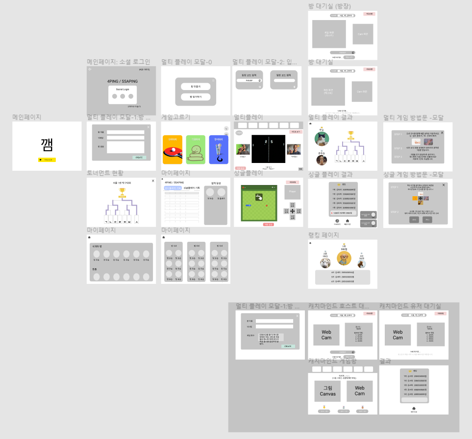
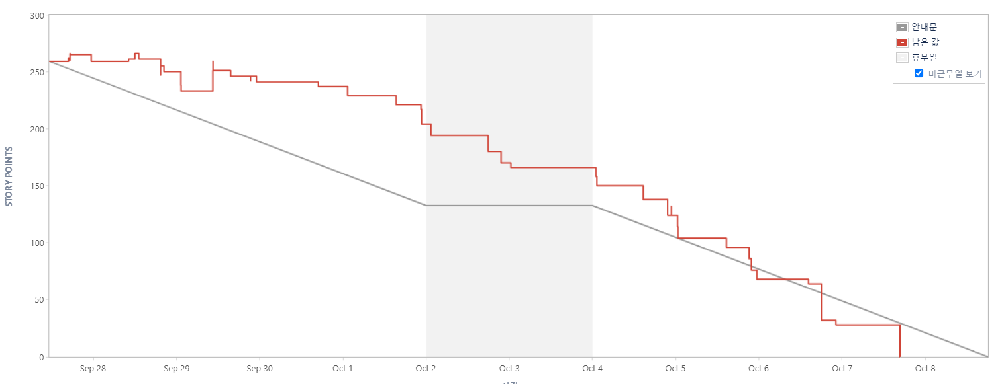
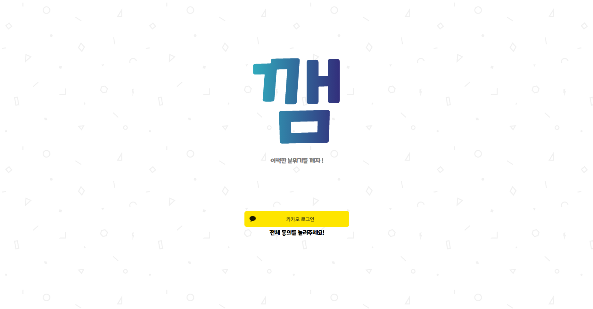
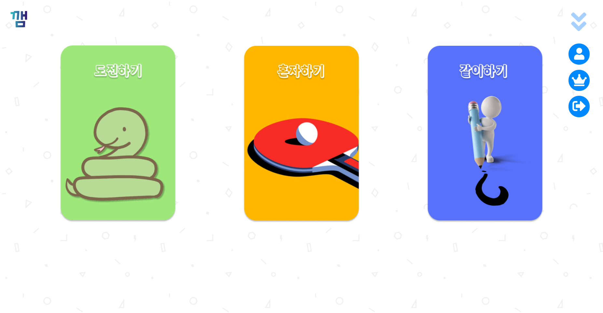
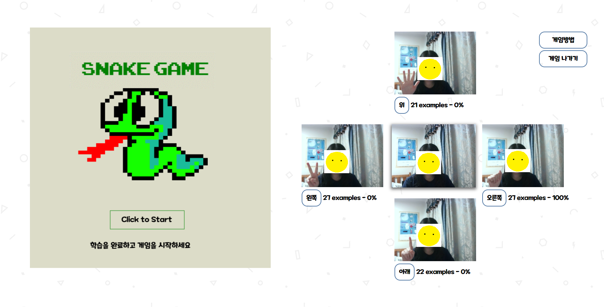
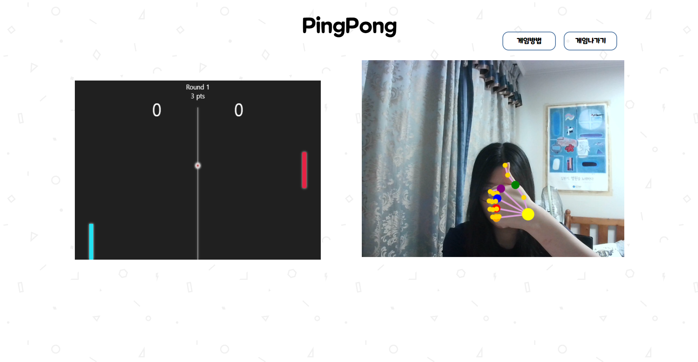
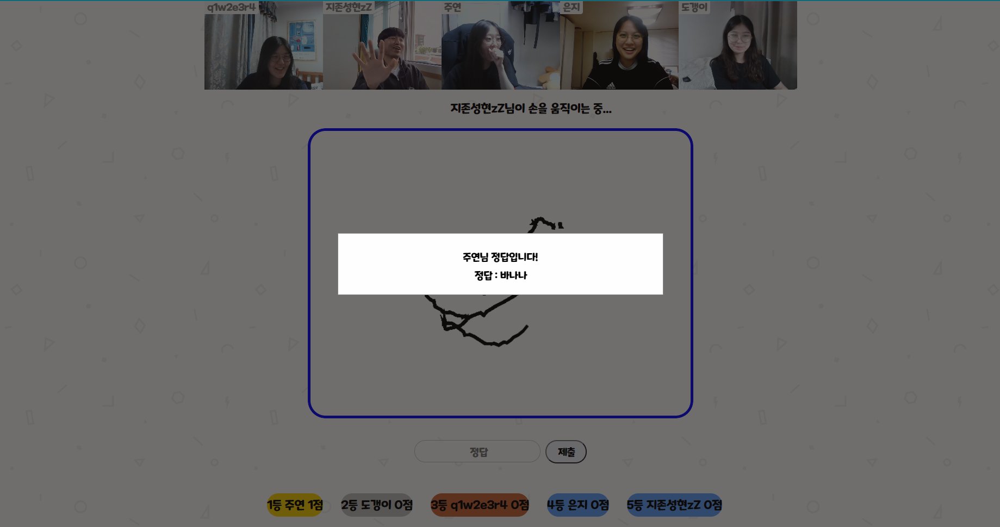
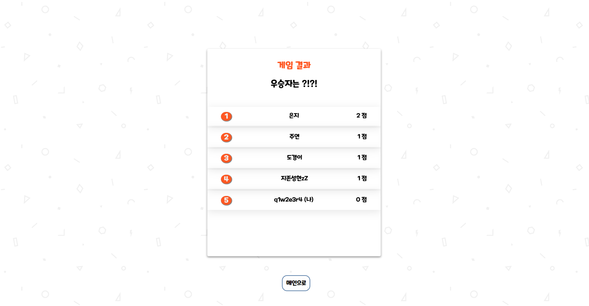
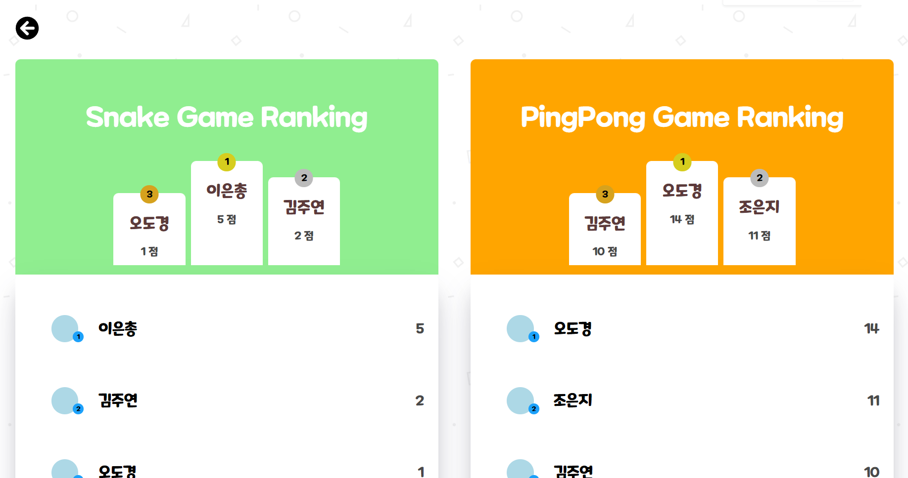
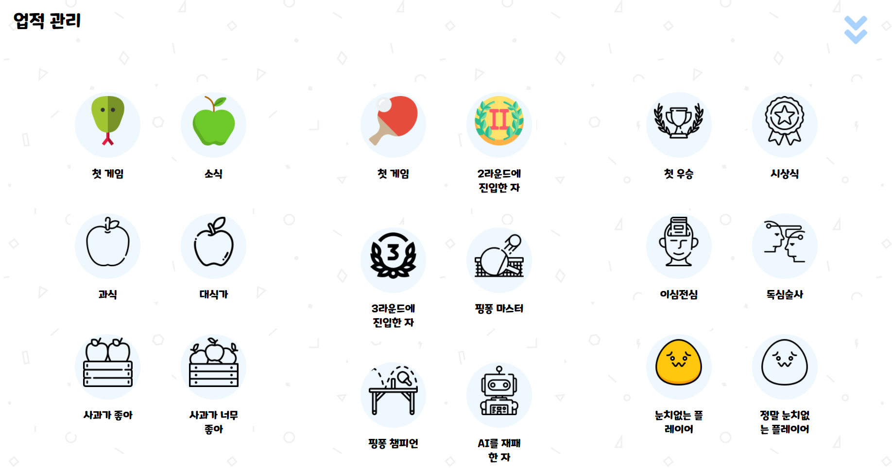

# README


## 0. 프로젝트 소개

**깸(GGAME)** 은 '어색함을 깨자' 라는 뜻입니다.

비대면 활동이 일상이 된 지금, 팀 구성원들 간의 빠른 🧊아이스 브레이킹🧊 을 위해 만들어졌습니다.

인공지능으로 제스처를 인식하는 다양한 게임들을 통해서 유저간 랭킹 경쟁, 개인 업적 해금 등의 재미를 느낄 수 있습니다.

### 특징

```
- 인공지능을 활용한 신체 인식 아이스 브레이킹 게임
- Socket.io를 통한 실시간 통신 멀티게임 
- Hand Gesture Detection 모델을 이용한 손 인식
- Teachable Machine을 이용한 이미지 학습 게임
- Hand Gesture Detection 모델을 이용한 AI와 탁구 대결
```

### 와이어 프레임



### ERD


## 1. 실행 방법

- `로컬에서 실행`하기 위해서는 콘솔창 2개로 프론트엔드와 백엔드를 동시에 실행해야 합니다.

``` bash
-- 프론트엔드 실행
cd frontend/
npm i
npm start

cd ..

-- 백엔드 실행
cd backend/
npm i
node server.js
```

- 배포 링크 (막힐 수 있음)

  https://j5a104.p.ssafy.io/
  
- `통합 빌드 실행`

``` bash
-- 프론트엔드 실행
cd frontend/
npm i
npm run build

cd ..

-- 백엔드 실행
cd backend/
npm i
node server.js
```


## 2. 개발 환경

### 기술 스택


### 협업툴

- **Jira** 

  애자일 협업, 스케줄 관리

  

- Notion 

  문서화, 정보공유

  https://www.notion.so/GGAEM-cb215da9a1114f668a2e2022541a4be4

- **Git** 

  - 코드 품질 관리, MR

  - 커밋 메세지 컨벤션 사용, 브랜치 네이밍 규칙 사용

## 3. 기능

### 로그인

- 카카오 소셜 로그인으로 회원가입 및 로그인을 할 수 있습니다.



### 메인페이지

- 게임을 선택 할 수 있습니다.
-  사이드의 메뉴 아이콘을 통해 업적 확인, 랭킹 확인, 로그아웃이 가능합니다.



### 게임

#### - 도전하기: 뱀과 사과 게임

- 상하좌우 모션을 등록하면 인공지능이 학습합니다. 많이 학습할 수록 인식률이 상승합니다.
  - 모든 모션이 100%가 될 때까지 학습해주세요.
  - 카메라에 모션을 취한채로 [위 / 아래 / 오른쪽 / 왼쪽] 버튼을 꾹 누르고 있으면 편한 학습이 가능합니다.

- 뱀이 사과를 먹을 때마다 점수가 1점씩 올라가고 뱀의 머리가 자신의 몸이나 벽에 부딪히면 게임 오버가 됩니다.

- 랭킹 페이지에서 랭킹을 다시 확인할 수 있습니다.



#### - 혼자하기: 핑퐁 게임

- 패들을 정해진 모션으로 조작하여 컴퓨터와 대결합니다.
  - ✌(V) 모션으로 **위**, 👍(엄지) 모션으로 **아래** 로 조작합니다.
- 라운드는 3개로 구성되어 있으며, 1·2 라운드에서는 3점, 7점을 얻을 때마다 다음 라운드로 진출합니다. 
- 3라운드에서는 컴퓨터가 10점이 되지 않는한 무한대로 플레이할 수 있습니다. 고득점을 노려 높은 랭킹을 노릴 수 있습니다.
- 랭킹 페이지에서 자신의 랭킹을 확인할 수 있습니다.



#### - 같이하기: 에어드로우 게임

- ✋(손바닥) 을 이용해 그림을 그릴 수 있습니다.
- 자기 차례에 캔버스를 클릭하고 **키보드 d** 키를 누르는 동안 그림을 그릴 수 있습니다.
- 호스트와 게스트 모두 대기실에서 게임을 연습해 볼 수 있습니다.







### 랭킹

- 싱글 플레이 게임의 점수를 추산해서 랭킹을 산정합니다.
- 친구들, 팀원들끼리 경쟁 가능합니다.



### 업적

- 각 게임마다 특정 조건을 만족하면 업적이 해금됩니다.



## 4. 역할

- 오도경
  - 팀장, Back-end
  - Tensorflow.js 핸드 제스처 인식 모델 활용
  - 배포
  - UCC 제작
- 김주연
  - Back-end
  - 소셜로그인
  - DB설계
  - REST API
  - 싱글플레이(핑퐁 게임)
- 이은총
  - Front-End (React, JS, CSS)
    - SPA 라우팅
    - 메인 페이지
    - 로그인 페이지
    - 업적 페이지
    - 공통 컴포넌트 개발(모달)
    - 기타 CSS 작업
- 조은지
  - Front-End
  - 싱글플레이(뱀과 사과 게임)
  - Tensorflow Teachable Machine 활용
  - canvas 게임 구현
  - 랭킹 페이지
  - 기타 CSS 작업
- 황성현
  - Full-Stack
  - [Front-End] 
    - 멀티플레이(Air draw 게임)
  - [Back-End] 
    - 웹소켓 서버 구축 
    - WebRTC 

